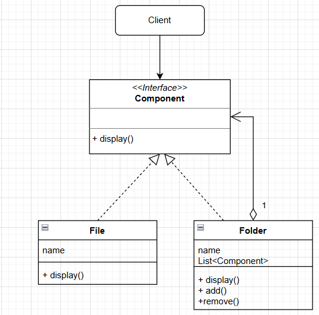
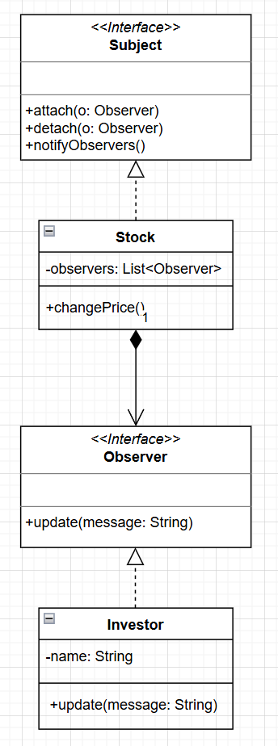
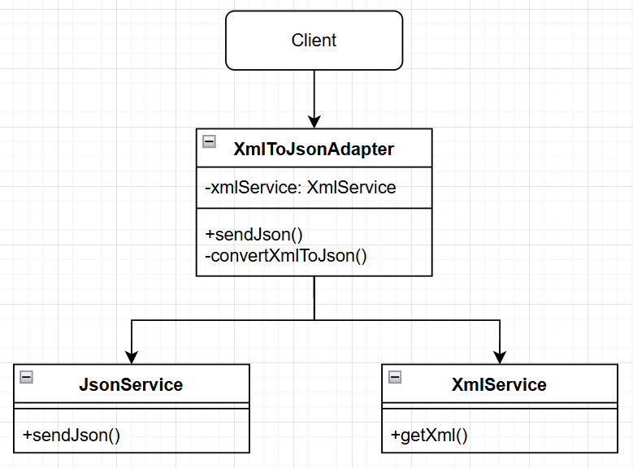
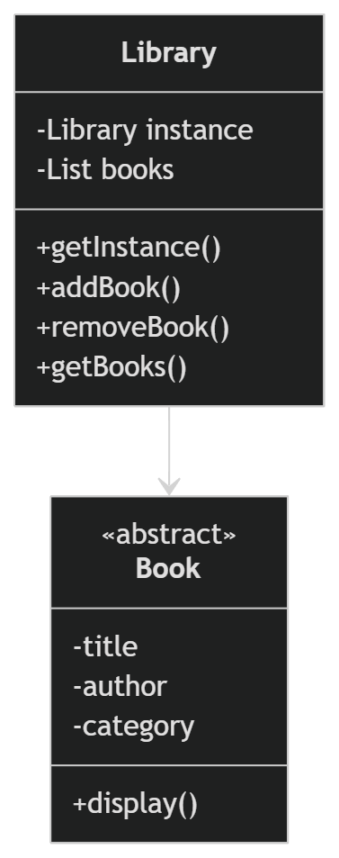
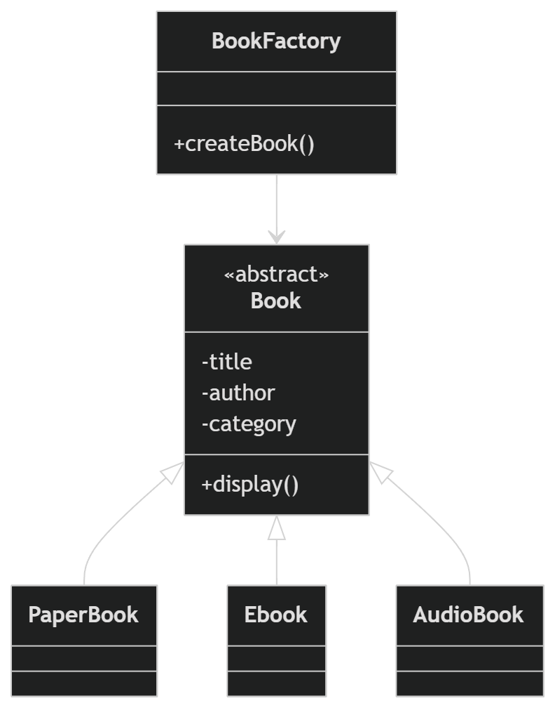
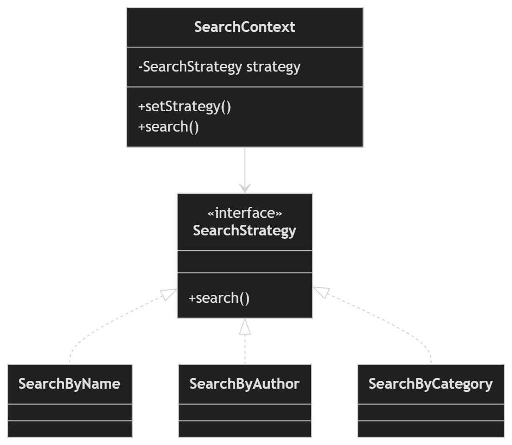
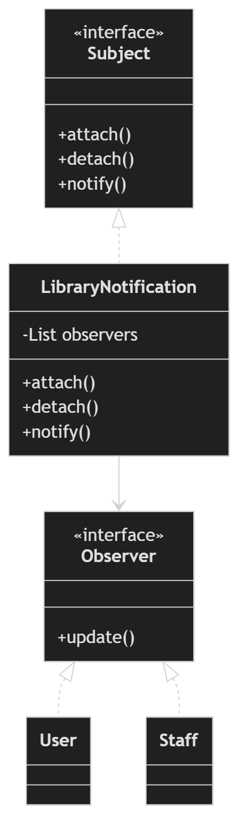
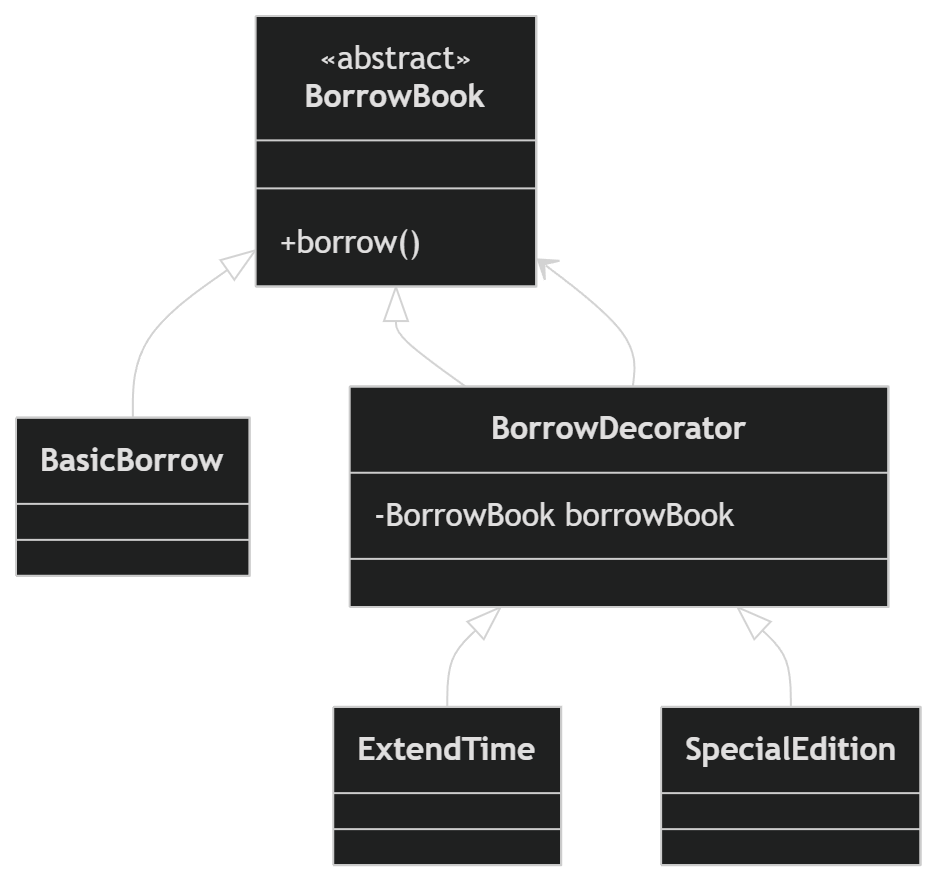

# Kiến Trúc Thiết Kế Phần Mềm - Design Patterns

## 1. Composite Design Pattern

### Diagram



### Giải Thích

**Mục đích:** Composite Pattern cho phép xây dựng các cấu trúc cây, trong đó khách hàng có thể xử lý các đối tượng cá nhân (Leaf) và các tập hợp đối tượng (Composite) theo cách thống nhất.

### Cấu trúc:

- **Component Interface:** Định nghĩa giao diện chung với phương thức `display()`
- **File:** Đại diện cho một tập tin đơn, implement `Component`
- **Folder:** Đại diện cho một thư mục có thể chứa nhiều `Component` (File hoặc Folder khác)

### Ưu điểm:

- Xử lý các cây phức tạp một cách đơn giản
- Dễ dàng thêm loại component mới
- Client code không cần quan tâm đến chi tiết implementation

### Ví dụ Sử Dụng:

```
Root Folder
├── File1.txt
├── File2.txt
└── SubFolder
    └── File3.txt
```

---

## 2. Observer Design Pattern (Stock Example)

### Diagram



### Giải Thích

**Mục đích:** Observer Pattern định nghĩa một mối quan hệ một-nhiều giữa các đối tượng sao cho khi một đối tượng (Subject) thay đổi trạng thái, tất cả các observer phụ thuộc vào nó sẽ được thông báo tự động.

### Cấu trúc:

- **Subject Interface:** Định nghĩa các phương thức quản lý observer (`attach`, `detach`, `notifyObservers`)
- **Stock (Concrete Subject):** Quản lý danh sách observer và thông báo khi giá thay đổi
- **Observer Interface:** Định nghĩa phương thức `update()` để nhận thông báo
- **Investor (Concrete Observer):** Nhận cập nhật từ Stock

### Ưu điểm:

- Giảm coupling giữa các đối tượng
- Hỗ trợ một-nhiều mối quan hệ
- Các observer không cần biết về nhau

### Trường Hợp Sử Dụng:

- Một nhà đầu tư (Investor) kích hoạt nhiều người dùng hành động
- Event handling systems
- Model-View-Controller (MVC) architecture

---

## 3. Adapter Design Pattern

### Diagram



### Giải Thích

**Mục đích:** Adapter Pattern cho phép các interface không tương thích làm việc cùng nhau. Nó chuyển đổi interface của một class thành interface khác mà client mong đợi.

### Cấu trúc:

- **XmlService:** Dịch vụ cung cấp dữ liệu XML
- **JsonInterface (Expected):** Interface mà client muốn sử dụng
- **XmlToJsonAdapter:** Bộ adapter chuyển đổi XML thành JSON

### Cơ Chế Hoạt Động:

1. Client gọi `XmlToJsonAdapter.sendJson()`
2. Adapter gọi `xmlService.getXml()` để lấy dữ liệu XML
3. Adapter chuyển đổi XML thành JSON bằng `convertXmlToJson()`
4. Trả kết quả JSON cho client

### Ưu điểm:

- Cho phép tích hợp với các library cũ
- Giảm coupling giữa client và legacy code
- Dễ bảo trì và mở rộng

### Trường Hợp Sử Dụng:

- Tích hợp các system cũ với system mới
- Chuyển đổi định dạng dữ liệu (XML ↔ JSON, CSV ↔ Database)
- API wrappers

---

## 4. Library Design Pattern (Hệ Thống Thư Viện)

Hệ thống thư viện là một ví dụ phức tạp kết hợp 5 design patterns khác nhau:

### 4.1 Singleton Pattern

**Diagram:**


**Giải Thích:**
Singleton đảm bảo một class chỉ có một instance duy nhất và cung cấp điểm truy cập toàn cục đến instance đó.

**Cấu trúc:**

```java
public class Library {
    private static Library instance;

    private Library() {} // Constructor private

    public static Library getInstance() {
        if (instance == null) {
            instance = new Library();
        }
        return instance;
    }
}
```

**Ưu điểm:**

- Đảm bảo chỉ có một thư viện duy nhất trong toàn ứng dụng
- Truy cập toàn cục nhưng kiểm soát chặt chẽ
- Lưu trữ danh sách sách duy nhất

**Trường Hợp Sử Dụng:**

- Database connections
- Configuration managers
- Logger instances
- Thư viện, cơ sở dữ liệu, cache

---

### 4.2 Factory Pattern

**Diagram:**


**Giải Thích:**
Factory Pattern cung cấp một interface để tạo ra các đối tượng, nhưng để các subclass quyết định class sẽ được khởi tạo.

**Cấu trúc:**

- **Book (Abstract Base Class):** Lớp cơ sở với các thuộc tính chung
- **PaperBook, Ebook, AudioBook:** Các loại sách cụ thể
- **BookFactory:** Lớp factory tạo các loại sách dựa trên tham số

**Ví dụ:**

```java
Book book1 = BookFactory.createBook("paper", "Title", "Author", "Category");
Book book2 = BookFactory.createBook("ebook", "Title", "Author", "Category");
Book book3 = BookFactory.createBook("audio", "Title", "Author", "Category");
```

**Ưu điểm:**

- Độc lập tạo các đối tượng khỏi lớp cụ thể
- Dễ thêm loại sách mới mà không sửa code hiện tại
- Tập trung logic tạo đối tượng

**Trường Hợp Sử Dụng:**

- Tạo đối tượng phức tạp
- Database connection factories
- Document parsers (PDF, Word, Excel)

---

### 4.3 Strategy Pattern

**Diagram:**


**Giải Thích:**
Strategy Pattern định nghĩa một họ các thuật toán, đóng gói từng cái, và làm cho chúng có thể hoán đổi.

**Cấu trúc:**

- **SearchStrategy Interface:** Định nghĩa phương thức tìm kiếm
- **SearchByName, SearchByAuthor, SearchByCategory:** Các chiến lược tìm kiếm cụ thể
- **SearchContext:** Lựa chọn strategy phù hợp

**Ví dụ:**

```java
SearchContext context = new SearchContext();
context.setStrategy(new SearchByAuthor());
List<Book> results = context.search(books, "authorName");

context.setStrategy(new SearchByName());
List<Book> results = context.search(books, "bookName");
```

**Ưu điểm:**

- Dễ thêm chiến lược mới
- Giảm các câu lệnh if-else dài
- Cho phép thay đổi thuật toán khi runtime

**Trường Hợp Sử Dụng:**

- Các chiến lược sắp xếp khác nhau
- Các loại thanh toán khác nhau
- Các mức nén dữ liệu khác nhau

---

### 4.4 Observer Pattern (Library Notification)

**Diagram:**


**Giải Thích:**
Observer Pattern được áp dụng để thông báo cho các người dùng khi sách mới được thêm vào thư viện.

**Cấu trúc:**

- **Subject:** Lớp quản lý thư viện
- **Observer Interface:** Phương thức `update()` để nhận thông báo
- **User (Concrete Observer):** Nhận cập nhật khi thư viện thay đổi
- **LibraryNotification:** Gửi thông báo đến các observer

**Ưu điểm:**

- Người dùng tự động được thông báo khi có sách mới
- Không cần polling để kiểm tra cập nhật
- Giảm coupling giữa thư viện và người dùng

**Trường Hợp Sử Dụng:**

- Email notification systems
- Event listeners
- Real-time updates

---

### 4.5 Decorator Pattern

**Diagram:**


**Giải Thích:**
Decorator Pattern cho phép thêm trách nhiệm mới cho một đối tượng một cách động mà không cần sửa code hiện tại.

**Cấu trúc:**

- **BorrowBook (Base Class):** Hành động mượn sách cơ bản
- **BorrowDecorator (Abstract Decorator):** Lớp trừu tượng decorator
- **BasicBorrow:** Mượn sách cơ bản
- **ExtendTime:** Decorator - mở rộng thời gian mượn
- **OtherDecorators:** Các decorator khác (bảo hiểm, ưu tiên, v.v.)

**Ví dụ:**

```java
BorrowBook basicBorrow = new BasicBorrow();
basicBorrow.borrow(); // Mượn sách

BorrowBook extendedBorrow = new ExtendTime(basicBorrow);
extendedBorrow.borrow(); // Mượn và mở rộng thời gian
```

**Ưu điểm:**

- Thêm tính năng không cần sửa class gốc
- Linh hoạt component kết hợp
- Tuân theo Open/Closed Principle

**Trường Hợp Sử Dụng:**

- UI components với các tính năng bổ sung
- Input/Output streams (Java)
- Pizza delivery system (toppings)

---
